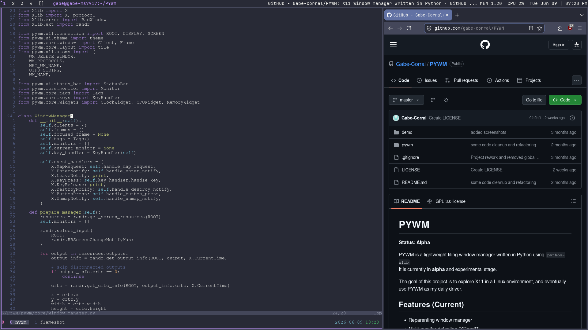
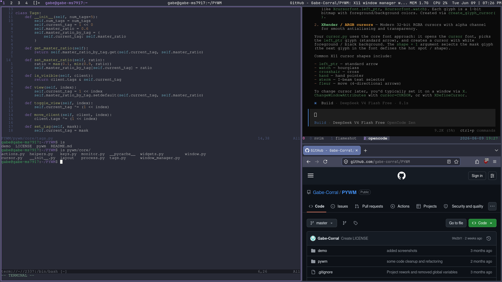
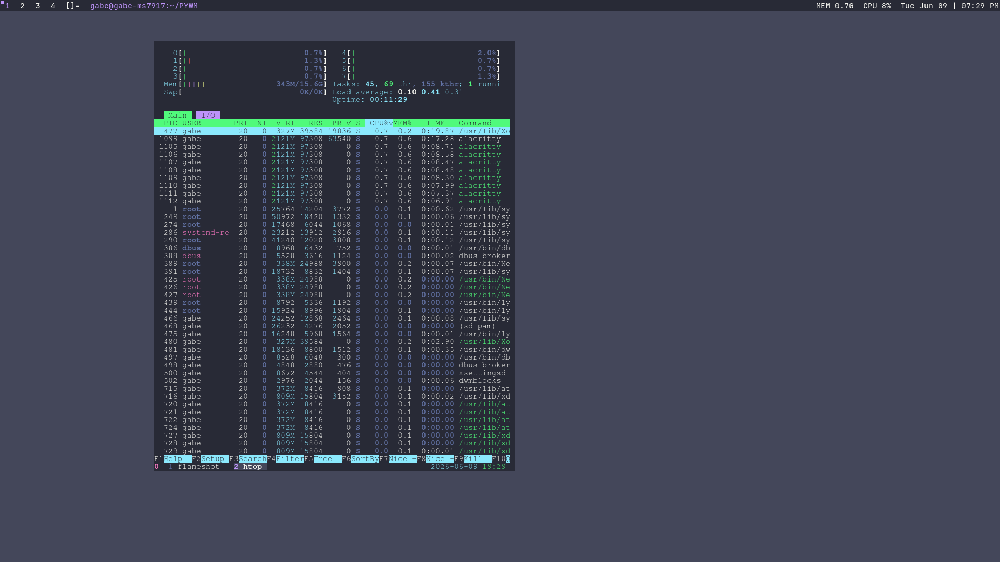

DevelOS
=======

DevelOS is a lightweight, opinionated Arch-based Linux distribution. It is minimal yet powerful.
The goal is to offer a distribution that does not include anything that is not necessary for an effective workflow.
No silly animations, visual effects, or anything that slows down the system.
Despite its minimal design, DevelOS aims to be highly usable immediately after installation.

[Website](https://develos.org)

This repository contains:

- An `archiso` profile used to build the ISO image.
- Configuration and source trees for tools like `dwm`, `dmenu`, and `dwmblocks-async` under `install/`.
- Helper scripts in `scripts/` to build the ISO and run it in QEMU.

Documentation
-------------

- [Build guide](docs/build.md): build packages, build the ISO, and test with QEMU.
- [Install guide](docs/install.md): install with Calamares or the CLI installer.
- [Calamares notes](docs/calamares.md): details about the graphical installer integration.
- [Roadmap](docs/roadmap.md): current distro and `dwmctl` development roadmap.
- [Suckless patches](docs/suckless-patches.md): notes on patched `dwm` and `dmenu` sources.

Building the ISO
----------------

See [docs/build.md](docs/build.md).

Running the ISO in QEMU
------------------------

See [docs/build.md](docs/build.md).

Installing DevelOS
------------------

See [docs/install.md](docs/install.md).

Roadmap
-------

See [docs/roadmap.md](docs/roadmap.md).

Screenshots
-----------

