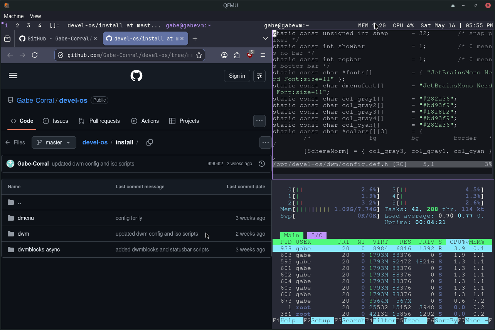

DevelOS
=======

DevelOS is a custom Arch Linux based development environment, built as a reproducible live ISO with a simple installer.

The long-term goal of this project is to grow into a small Arch-based distribution focused on developers, minimalism, and performance: a fast, no-frills environment with a curated set of tools and configs that stay out of your way.



This repository contains:
- An `archiso` profile used to build the ISO image.
- Configuration and source trees for tools like `dwm`, `dmenu`, and `dwmblocks-async` under `install/`.
- Helper scripts in `scripts/` to build the ISO and run it in QEMU.

Requirements
------------

You should build DevelOS on an Arch Linux (or Arch-derived) host with:
- `podman`
- `archiso` (provides `mkarchiso`)
- `qemu` (optional, for testing in a VM)

Building the ISO
----------------

From the repository root:

```bash
./scripts/build-iso.sh
```

This will:
- Sync the `install/` sources into the `archiso` profile.
- Build a container image `devel-os-builder`.
- Run `mkarchiso` inside the container.

On success, an ISO image will be placed under `output/` (for example, `output/develos-YYYY.MM.DD-x86_64.iso`).

Running the ISO in QEMU
------------------------

For a simple live-boot test:

```bash
./scripts/run-qemu.sh output/<your-iso-name>.iso
```

For a full install test to a virtual disk and then boot from the installed system:

```bash
./scripts/run-qemu-install.sh output/<your-iso-name>.iso vm/develos.qcow2
```

Installing DevelOS on Bare Metal
--------------------------------

1. Write the built ISO to a USB drive using your preferred tool (for example, `dd`, `cp`, or `gnome-disks`).
2. Boot the target machine from the USB.
3. Once in the live environment, run the installer as root:

   ```bash
   develos-install
   ```

4. Follow the prompts:
   - Select the target disk (this will be erased).
   - Set hostname, username, and timezone.
   - Confirm the installation when asked.

The installer will partition the disk (UEFI + root), install the base system, and copy the configured environment.

Roadmap
-------

- [x] Stop copying/building custom software manually; package `dwm`, `dmenu`, and `dwmblocks-async` with `PKGBUILD`s.
- [x] Create a small DevelOS pacman repository and install DevelOS packages from it during ISO builds and system installs.
- [ ] Package DevelOS configs and the installer instead of copying them from `airootfs`.
- [ ] Split live ISO packages from installed system packages so the installed OS stays clean.
- [ ] Add Calamares for graphical system installs while keeping the CLI installer as a fallback.
- [ ] Add DevelOS release/branding files such as `os-release`, bootloader branding, and default system metadata.
- [ ] Add automated ISO build and QEMU install tests before publishing releases.
